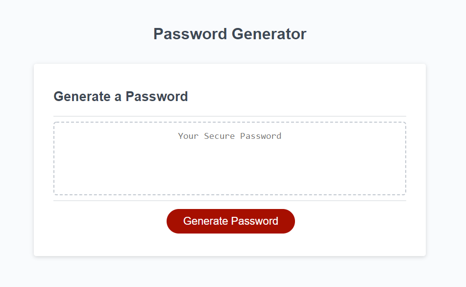
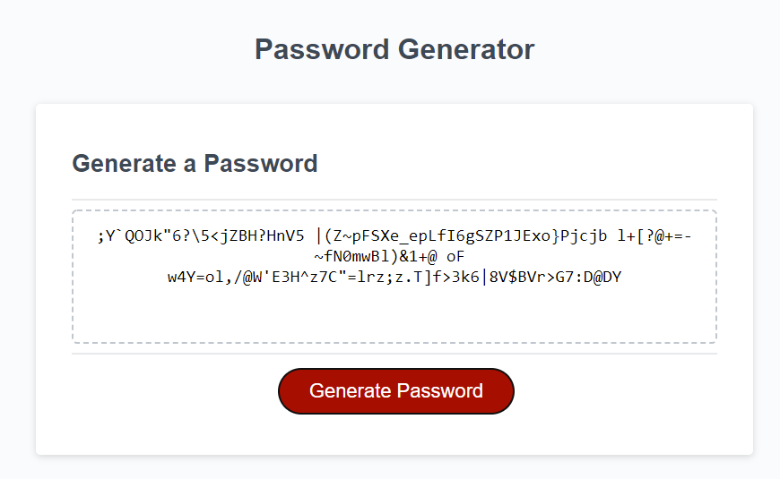

# Password Generator

A simple web [application](https://lcortes0801.github.io/password_generator) that will generate a random password based on user selected criteria.

## Implementation

### Password criteria

When the user requests the password they are presented with a series of prompts to collect the desired password criteria. First, the user is prompted for the length of the password, and then for the types of character to include. The types of characters are lowercase, uppercase, numbers and special symbols.

The prompts will only accept the specific type of data they are requesting, for example, the length prompt will only accept numbers between 8 and 128. Hittting cancel at any time will stop the password generation process.

*Note: For the character prompts, `confirm()` could have been used instead of `prompt()`, since it is a binary answer the site is looking for, but the Ok/Cancel buttons do not convey the same semantic as Yes/No buttons. Hence, `prompt()` was used and a variety of answers (yes, y, no, n, ...) will be accepted.*

### Password generation

First, the system makes sure there is at least one character of each selected type. For this, a character of each tpe is selected from a character pool and placed at an index selected at random. Since the indexes are picked at random, index collision may happen, but this is resolved by iterating until the next free index is found. This process will always find a free or empty index, since only 4 character types are available and the password length is at least 8.

Once this process in finished, the selected character pools are merged into a single pool and used to pick a random character for each of the remaining positions. This concludes the password generation.

